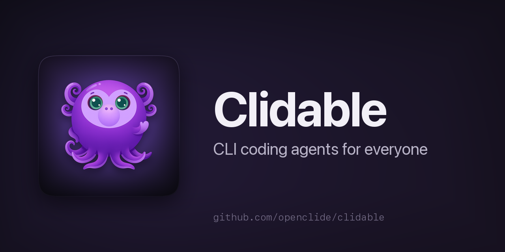

<div align="center">



# Clidable

**CLI coding agents for everyone** — real terminals for Claude Code, Codex,
Antigravity and friends, driven from a chat-style message box, with rewindable
checkpoints, live preview, and one-click MCP / skills / plugins.

[](https://github.com/openclide/clidable/actions/workflows/ci.yml)
[](https://github.com/openclide/clidable/releases)
[](LICENSE)
[](https://bun.sh)

[Documentation](docs/README.md) · [Remote & VPS](docs/remote-vps.md) · [Releases](https://github.com/openclide/clidable/releases)

</div>

---

Coding agents are brilliant on the command line and painful to live in.
Clidable keeps each agent's **real terminal** (its native TUI over a PTY) and
builds the workspace around it: a proper text box to type in, a snapshot of
your project before every message, your app running live beside the agent, and
one place to manage MCP servers, skills, and plugins for every agent at once.

One Bun process, one port. The same server runs on your laptop, on a VPS, or
inside the desktop app — and your agents **keep running when you close the
tab**.

## Quick start

**Desktop app** — download the installer for macOS, Windows, or Linux from the
[Releases page](https://github.com/openclide/clidable/releases) and open it.
The app carries its own server — there is nothing else to install.

**Prefer the browser?** Run just the server and open
**http://127.0.0.1:7878** instead:

**Homebrew** (macOS / Linux):

```sh
brew install openclide/tap/clidable
clidable
```

**Install script** (macOS / Linux — detects your OS/arch, verifies checksums,
installs to `~/.local/bin`):

```sh
curl -fsSL https://raw.githubusercontent.com/openclide/clidable/main/install.sh | bash
```

**Windows** — download `clidable-server-windows-x64.exe` (or
`clidable-server-windows-arm64.exe` on Snapdragon-X / ARM machines) from the
[Releases page](https://github.com/openclide/clidable/releases) and run it.

**From source** — needs [Bun](https://bun.sh) ≥ 1.3.14:

```sh
git clone https://github.com/openclide/clidable
cd clidable && bun install && bun run dev
```

Either way you land in the same UI:

1. **Pick an agent.** Clidable detects what's installed — Claude Code, Codex,
   Antigravity, Cursor, Qwen Code, Kimi, OpenCode, Copilot, or a plain
   terminal. Agents bring their own login: if it works in your terminal, it
   works here. No API keys to configure.
2. **Open a project** — any folder on disk — or scaffold a fresh one (Next.js,
   Astro, Expo, Hono, Svelte, Vue, and more).
3. **Type in the composer**, the text box under the terminal: multi-line
   editing, image & file attachments, and the agent's own `/` and `@` menus — all
   delivered to the TUI as one clean paste. A checkpoint of your project is
   snapped before every message. The terminal above stays fully interactive
   whenever you'd rather drive the TUI directly.
4. **See your app live.** Clidable starts your dev server (auto-detected,
   configurable per project) and renders it beside the terminal in desktop,
   tablet, and phone viewports.

## What's inside

- **Agents in real terminals** — the true TUI over a PTY, rendered with
  xterm.js. Never headless, never a parsed JSON stream: what you see is
  exactly what the agent shows.
- **Checkpoints you can rewind** — a snapshot before every message, kept in a
  private shadow-git repo. Restore the whole project in one click; your real
  `.git` is never touched.
- **Sessions that survive you** — close the tab, close the window, come back
  later: agents keep working, and the terminal picks up with scrollback
  intact. Live status (working / needs you / done) shows on the workspace dock
  and in the desktop app's menu-bar tray.
- **A code editor with diffs** — VS-Code-feel editing beside the terminal, and
  per-checkpoint diffs of what the agent changed.
- **MCP, skills & plugins, once** — install a thing one time and Clidable
  wires it into every agent that supports it, keeping a shared `AGENTS.md` in
  sync.
- **AI teams** — a lead agent that delegates to specialist roles in their own
  terminals.
- **Multi-project workspaces** — several projects side by side, each with its
  own agents, tabs, and preview.
- **Everywhere** — any browser, an installable PWA on your phone, or a native
  desktop app (a thin Tauri shell with OS window vibrancy).

## The desktop app

The browser UI is the full product — the desktop app wraps the same server and
adds the native touches: a vibrancy window that blurs what's behind it, a
menu-bar tray with each agent's live status, and a **background server** —
closing the window keeps your agents running; the tray's Quit is the real
off-switch. If you also installed the server CLI (Homebrew / install script),
`clidable open .` opens that folder — in the app on macOS, in the browser
elsewhere.

Installers are on the [Releases
page](https://github.com/openclide/clidable/releases). Building it yourself is
also one command with the [Rust toolchain](https://rustup.rs) installed —
`bun run tauri:build` compiles the server into a sidecar automatically and
drops a bundle for your platform (`.app`/`.dmg`, AppImage/deb/rpm, or NSIS
installer) in `src-tauri/target/release/bundle/`.

## Use it from a server (Tailscale)

Clidable is **localhost-only by design** — it spawns terminals, so exposing it
to a network would be handing out remote code execution. The server refuses
non-loopback binds unless you explicitly opt in (`--allow-lan`), and the
recommended remote setup never needs that:

```sh
# On the server
curl -fsSL https://tailscale.com/install.sh | sh && sudo tailscale up
curl -fsSL https://raw.githubusercontent.com/openclide/clidable/main/install.sh | bash
clidable               # binds 127.0.0.1:7878, as always
```

```sh
# On your laptop (Tailscale installed and logged in)
ssh -N -L 7878:127.0.0.1:7878 you@your-server
```

Open **http://127.0.0.1:7878** — you're using Clidable on the server, from
anywhere. SSH rides the tailnet, so Tailscale's authentication and WireGuard
encryption are the security boundary and **zero ports are open to the
internet**. On a phone, an SSH client that forwards ports (e.g. Termius) does
the same job.

Note: `tailscale serve` alone won't work — it forwards the tailnet hostname
and Clidable's same-site gate only accepts loopback. The
[Remote & VPS guide](docs/remote-vps.md) covers that, reverse-proxy setups,
and the full security model.

## The CLI

The same binary is the command-line surface. Homebrew and the install script
put it on PATH as `clidable`; on Windows the downloaded `.exe` itself is the
command (rename it to `clidable.exe` if you like). The `clidable-server`
spelling survives only as the download-artifact filename (and, inside the
desktop app, the bundled server binary):

```sh
clidable open .          # open this folder in Clidable (app or browser)
clidable stop            # stop the background server

clidable skills …        # manage skills across agents
clidable mcp …           # manage MCP servers
clidable plugins …       # manage plugins
clidable instructions …  # manage AGENTS.md / instructions files
clidable team …          # AI-team roles and delegation
```

See the [CLI reference](docs/cli-reference.md).

## Develop

```sh
bun install
bun run dev              # server + frontend at http://127.0.0.1:7878 (HMR)
bun run tauri:dev        # native desktop window (requires Rust toolchain)

bun run typecheck        # tsc --noEmit across the tree
bun run test             # unit tests (server + shared + web)
bun run build:compile    # single-file binary → dist/clidable-server
```

See [CONTRIBUTING.md](CONTRIBUTING.md) for the workflow and
[CLAUDE.md](CLAUDE.md) for architecture decisions and hard-won gotchas.

## Project status

Pre-1.0, core experience working: terminals + composer, durable sessions,
checkpoints, editor + diffs, projects + auto-launched preview,
skills/MCP/plugins/instructions managers, AI-team delegation, Windows support.
On the roadmap: signed desktop bundles, checkpoint retention, mobile polish.
See [PLAN.md](PLAN.md).

## License

[Apache-2.0](LICENSE) © 2026 — free to run, read, fork, and ship.
